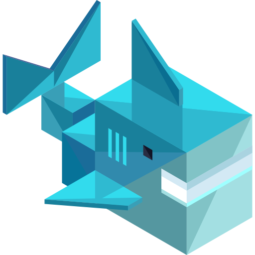

<p align="center">
  
</p>

<h1 align="center">Fitshark — Backorder Reply System (Duvo)</h1>

An end-to-end AI automation built on **[Duvo](https://duvo.ai)** that answers customer inquiries about
**out-of-stock auto parts**. It reads customer questions, finds the matching product across 11 supplier
feeds, writes a polished branded reply (price + delivery + a unique one-click order link), attaches a
branded PDF quote, **gets human approval for every email**, sends it, logs the answer, saves the
customer's vehicle for later offers, and follows up if the customer doesn't respond.

It runs on a **parallel Case Queue** so many inquiries are processed at the same time — each becomes its
own approval in the Activity Inbox instead of being handled strictly one-by-one.

> ⚠️ All data in this repo is synthetic — fictional suppliers, random codes/EANs/prices. Test customer
> emails go to the team's own inboxes. Manufacturer brands and vehicle models are real for feed realism.

---

## 1. The data (this repo)

| Path | What it is |
|------|-----------|
| `feeds/feed_*.tsv` | 11 synthetic supplier feeds, ~10,000 SKUs each, 70 columns (the product catalog source). |
| `questions/customer_questions.csv` | 100 customer inquiries about out-of-stock parts (multilingual). `customer_email` is set to the test inbox so replies arrive there. Also holds `expected_*` oracle columns for validation (the agents ignore them). |
| `duvo/` | The Duvo build: agent SOPs, skills, helper scripts, configs. |
| `duvo/catalog.csv` | A slim, consolidated catalog (110k rows) generated from the feeds — *gitignored* (regenerate with `duvo/prepare_duvo_data.py`). |

In Duvo, the feeds and questions live in Google Drive:
- **MOTOR PARTS** — the 11 `feed_*.tsv` files.
- **MOTOR PARTS QUESTIONS** — `customer_questions.csv`.

---

## 2. How it works (architecture)


<details>
<summary>Text version of the diagram</summary>

```
   Google Drive: MOTOR PARTS QUESTIONS / customer_questions.csv   (grows over time)
                                  │
                                  ▼
   ┌──────────────────────────────────────────────────────────────────┐
   │  PRODUCER agent  (scheduled hourly)                                │
   │  • reads the CSV, dedups vs existing cases                         │
   │  • downloads the 11 feeds ONCE, matches each new inquiry + upsell  │
   │  • enqueues one CASE per inquiry with the product PRE-MATCHED      │
   └──────────────────────────────────────────────────────────────────┘
                                  │
                                  ▼
            ┌──────────────────────────────────────────┐
            │  Case Queue "fitshark-questions"           │   one CASE per inquiry (data has the match)
            └──────────────────────────────────────────┘
                                  │  case trigger (CONCURRENCY = 10)
            ┌──────────────┬──────┴───────┬──────────────┐   ← PARALLEL: up to 10 at once
            ▼              ▼              ▼              ▼
         Job (case)     Job (case)    Job (case)    Job (case)     each is an independent
            │              │              │              │         job with its OWN approval
   CONSUMER per job (lightweight — NO feed search):  compose branded HTML reply (skills) from the
   pre-matched data → attach PDF quote → ▶ HUMAN APPROVAL (Activity Inbox) ──→ send HTML email (Gmail)
                          │
                          ▼
        Google Sheets:  Responses Log  +  Customer Vehicles        (audit + CRM for later offers)
                          │
                          ▼
        Auto follow-up after 3 days (if the customer hasn't replied/ordered) — also human-approved.

        Later / separately:  Campaign agent reads Customer Vehicles → personalized seasonal offers.
```

</details>

**Producer / consumer split = efficiency.** The producer downloads the 66 MB of feeds **once per hour**
and pre-resolves the match into each case; the consumer never touches the feeds, so the 10 parallel
consumer jobs are cheap and fast.

**Why a Case Queue?** A single agent run can only hold one Human-in-the-Loop approval at a time (it
pauses until you answer), which would force sequential approving. By turning each inquiry into a **case**
and running a **consumer with concurrency 10**, up to 10 inquiries are processed simultaneously — so ~10
approvals appear in the Activity Inbox at once and you approve them independently, in any order.

---

## 3. Skills (reusable knowledge packs, attached to the agents)

Each skill is a `SKILL.md` under `duvo/skills/`. Skills are attached to a build **by skill ID**
(attaching by name silently fails with "Unknown skill").

### `fitshark-brand-voice`
- **What:** the single source of truth for *how* Fitshark talks — every customer-facing skill follows it.
- **Defines:** tone (professional, warm, concise); formatting (greeting, price/delivery as a labelled list, one primary CTA, sign-off "Fitshark Customer Care"); glossary ("available on order", "incl. VAT", …).
- **Trust:** the fitment-guarantee line — "✓ Confirmed to fit your <vehicle> — or we'll make it right".
- **Hard don'ts:** never expose supplier names / SKU codes / wholesale prices / margins; never overpromise.
- **Used by:** Consumer, Campaign.

### `fitshark-reply-writer`
- **What:** composes the customer reply itself.
- **Input:** customer_question, matched product (name, brand, variant, vehicle, availability, price incl. VAT, currency, lead_time, image_url), ORDER_LINK + PRODUCT_LINK, today's date, optional upsell items.
- **Output:** `SUBJECT`, a plain-text `BODY`, and a branded **HTML** `BODY` — a ~600px FITSHARK card with product image, status badge, price/delivery box, "Order this part" button, optional "You might also need" block, footer.
- **Tone:** opens with the reassuring "even though it isn't in stock, we've been able to secure it for you" framing, **in the customer's own language** (EN/SK/CZ/DE/…).
- **Send rule:** the HTML body is sent with `isHtml: true` so it renders as the branded email.
- **Used by:** Consumer, Campaign.

### `fitshark-product-link`
- **What:** builds two links deterministically from the SKU.
- **Product page:** `…/p/<sku-slug>`.
- **Unique order link:** `…/order/<question_id>-<sku-slug>?email=<urlencoded>&utm_…` — unique per customer + product, opens a pre-filled order.
- **Safety:** returns empty + a signal if the SKU is missing (never fabricates one).
- **Used by:** Consumer, Campaign.

### `fitshark-upsell-recommender`
- **What:** proposes relevant add-ons to raise order value without being pushy.
- **How:** **1–3** companion parts via a category cross-sell map (bulb→pair/wipers, battery→terminals/charger, brakes→discs/fluid, …) + at most one premium **trade-up**.
- **Guardrails:** every suggestion must fit the same vehicle (or be Universal) and have a real catalog price; returns "(none)" rather than padding.
- **Used by:** Consumer (and Campaign for enrichment). *In the queue build the producer pre-selects the items and the consumer just renders them.*

### `fitshark-quote-pdf`
- **What:** generates a one-page branded **PDF price quote** and attaches it to the email.
- **Contains:** FITSHARK header, quote ref = question_id, bill-to, line-item table (Qty / unit price incl. VAT / line total), grand total, valid-until date, order link.
- **How:** built in the sandbox via Python; prices must match the matched catalog row.
- **Resilient:** if no PDF library/attachment is available it falls back to an inline quote and **never blocks the send**.
- **Used by:** Consumer.

### `fitshark-offer-personalizer`
- **What:** the campaign brain — turns a saved customer + vehicle into the next relevant offer.
- **How:** given the Customer Vehicles row + current season, picks **2–4** fitting, well-timed parts (seasonal logic — winter→battery/tyres, plus service items due by vehicle age).
- **Guardrails:** avoids re-offering the last item, respects opt-out, returns a themed offer with rationale.
- **Used by:** Campaign (the "we have something for your car" re-engagement campaigns).

---

## 4. Agents (Duvo)

Three active agents:

| Agent | Role | Schedule |
|-------|------|----------|
| **Fitshark — Question Producer (Queue)** | Reads the Drive CSV, dedups vs existing cases, downloads feeds once, matches new inquiries + upsell, enqueues pre-matched **cases**. Connections: Drive + Case Queue (Producer). | **Hourly** (enabled) |
| **Fitshark — Reply Consumer (Queue)** | **Primary.** Case-queue **consumer**, trigger **concurrency 10**. Per case (no feed search): compose branded HTML reply from the pre-matched data → HITL approval → send → log → save vehicle → resolve case. Connections: Sheets + Gmail + HITL + Case Queue (Consumer). | case-triggered |
| **Fitshark — Personalized Offers (Campaign)** | Reads Customer Vehicles → personalized seasonal offers (offer-personalizer) → human-approved sends → Campaign Log. Connections: Sheets + Drive + Gmail + HITL. | Weekly (disabled until vehicle data exists) |

---

## 5. Connections & storage

- **Google Drive** — read the questions CSV and the supplier feeds. *(Read-only via Duvo — the connector cannot write back to Drive.)*
- **Google Sheets** — the agents create and maintain:
  - **Fitshark — Responses Log** — one row per answered inquiry (status, matched SKU, price, lead time, order link, language, follow-up date, …).
  - **Fitshark — Customer Vehicles** — one row per customer+vehicle (CRM for the campaign agent).
  - **Fitshark — Campaign Log** — personalized offers sent (campaign agent).
- **Gmail** — sends the reply; recipient is the `customer_email` on each row.
- **Human-in-the-Loop** — every email (reply and follow-up) is approved in the Activity Inbox before sending. `request_approval` is asynchronous: the consumer stops after requesting approval and waits to be re-invoked, then sends only on approval (never auto-sends).

---

## 6. Key behaviours

- **Hands-free**: agents create the sheets they need and never ask the operator to set anything up; product matching happens in the producer (grep over the Drive feeds in the sandbox).
- **Dedup / growing CSV**: each inquiry becomes a case exactly once; new questions added to the CSV become new cases on the next hourly producer run.
- **Confidence gate**: ambiguous matches are not guessed — they're flagged "Needs review" / failed rather than sent.
- **Auto-language**: the reply is written in the customer's language.
- **Upsell + fitment + PDF quote**: every reply can include relevant add-ons, a fitment-guarantee line, and an attached branded quote.
- **Auto follow-up**: 3 days after sending, if the customer hasn't replied, a single approved reminder is sent.

---

## 7. Known limitations

- **Email rendering:** the reply is sent as the branded **HTML template** (FITSHARK card, status badge,
  "Order this part" button, upsell, footer) by calling the Gmail send tool with `isHtml: true`. A branded
  **PDF quote** is also attached. The same template is used for in-stock and out-of-stock replies — only
  the badge and the price/delivery values change.
- **Order links** point at the demo storefront `shop.fitshark.example` — swap the base URL for a real shop to make them live.
- The Google **Drive connector is read-only** (download + list; no upload).

---

## 8. Operate it

- **Build the pre-matched cases:** `python3 duvo/build_cases.py` → `duvo/cases.json`.
- **Seed the queue:** `duvo cases create --queue <id> --from-file duvo/cases.json` (or let the hourly producer enqueue new inquiries automatically).
- The consumer's case trigger then dispatches up to 10 jobs in parallel; approve each reply in the **Activity Inbox** (or Slack/Teams if enabled).
- **Regenerate the slim catalog:** `python3 duvo/prepare_duvo_data.py`.
- The build is driven through the `@duvoai/cli` (a thin wrapper over the Duvo API), which mirrors the Duvo MCP server — anything here can also be done from a Duvo-MCP-connected client.

---

*Synthetic data only. Brands and vehicle models are real only for feed realism.*
